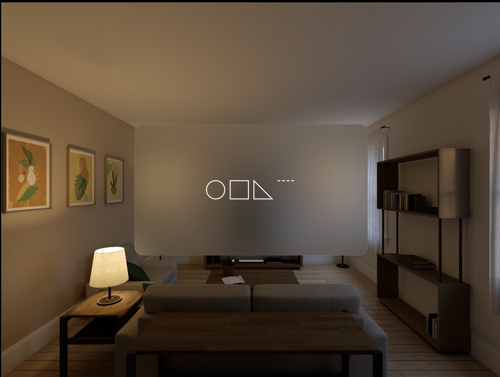
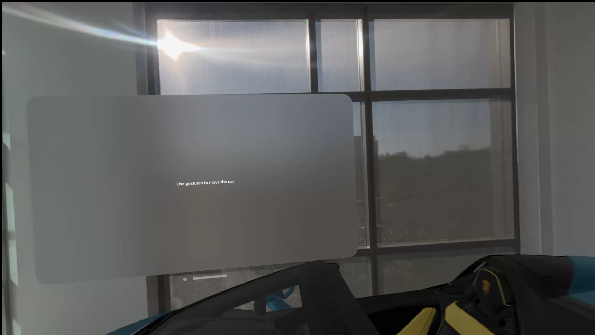
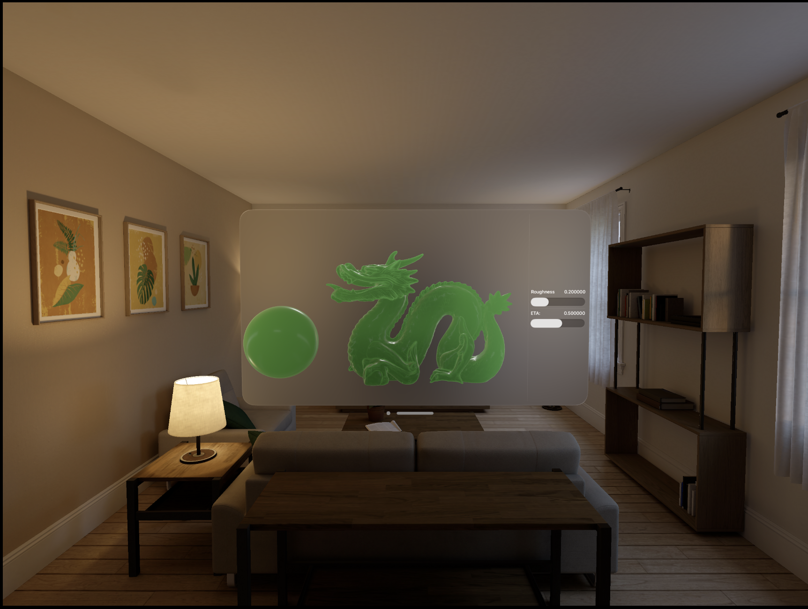
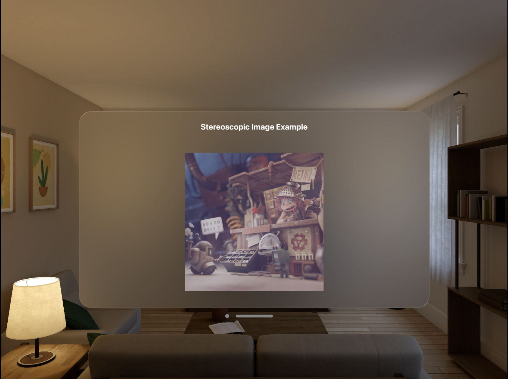

# official_visionOS_samples

| Title                                                                                                                                                                                                              | Image                                                                                                                                              |
| ------------------------------------------------------------------------------------------------------------------------------------------------------------------------------------------------------------------ | -------------------------------------------------------------------------------------------------------------------------------------------------- |
| [AddingADepthEffectToTextInVisionOS](https://developer.apple.com/documentation/visionos/adding-a-depth-effect-to-text-in-visionos)                                                                                 |                                                              |
| [AllowingObjectsToInteractWithRealWorldObjects](https://developer.apple.com/documentation/visionos/obscuring-virtual-items-in-a-scene-behind-real-world-items)                                                     |                                        |
| [ApplyingMeshToRealWorldSurroundings](https://developer.apple.com/documentation/visionos/applying-mesh-to-real-world-surroundings)                                                                                 |                                                            |
| [BOTAnist](https://developer.apple.com/documentation/visionos/bot-anist)                                                                                                                                           |                                                                                                                  |
| [BuildingLocalExperiencesWithRoomTracking](https://developer.apple.com/documentation/visionos/building_local_experiences_with_room_tracking)                                                                       |                                                  |
| [Combining2DAnd3DViewsInAnImmersiveApp](https://developer.apple.com/documentation/realitykit/combining-2d-and-3d-views-in-an-immersive-app)                                                                        |                                                        |
| [ComposingInteractive3DContentWithRealityKitAndRealityComposerPro](https://developer.apple.com/documentation/realitykit/composing-interactive-3d-content-with-realitykit-and-reality-composer-pro)                 |  |
| [ConstructAnImmersiveEnvironmentForVisionOS](https://developer.apple.com/documentation/realitykit/construct-an-immersive-environment-for-visionos)                                                                 |                                              |
| [ConvertingSideBySide3DVideoToMultiviewHEVCAndSpatialVideo](https://developer.apple.com/documentation/avfoundation/media_reading_and_writing/converting_side-by-side_3d_video_to_multiview_hevc_and_spatial_video) |                |
| [Creating2DShapesInVisionOSWithSwiftUI](https://developer.apple.com/documentation/visionos/creating-2d-shapes-in-visionos-with-swiftui)                                                                            |                                                        |
| [Creating3DEntitiesInVisionOSWithRealityKit](https://developer.apple.com/documentation/visionos/creating-3d-shapes-in-visionos-with-realitykit)                                                                    |                                              |
| [CreatingA3DModelWithGesturesInVisionOS](https://developer.apple.com/documentation/visionos/creating-an-interactable-3d-model-in-visionos)                                                                         |                                                      |
| [CreatingA3DPaintingSpaceInVisionOS](https://developer.apple.com/documentation/visionos/creating-a-painting-space-in-visionos)                                                                                     |                                                              |
| [CreatingANewSwiftUIWindowViewInVisionOS](https://developer.apple.com/documentation/visionos/creating-a-new-swiftui-window-in-visionos)                                                                            |                                                    |
| [CreatingASpaceshipGame](https://developer.apple.com/documentation/realitykit/creating-a-spaceship-game)                                                                                                           |                                                                                      |
| [CreatingASpatialDrawingAppWithRealityKit](https://developer.apple.com/documentation/realitykit/creating-a-spatial-drawing-app-with-realitykit)                                                                    |                                                  |
| [CreatingAVolumetricWindowInVisionOS](https://developer.apple.com/documentation/visionos/creating-a-volumetric-window-in-visionos)                                                                                 |                                                            |
| [CreatingGlassMaterialFor3DShapesInVisionOS](https://developer.apple.com/documentation/visionos/implementing-adjustable-material-in-visionos)                                                                      |                                              |
| [CreatingImmersiveSpacesInVisionOSWithSwiftUI](https://developer.apple.com/documentation/visionos/creating-immersive-spaces-in-visionos-with-swiftui)                                                              |                                          |
| [CreatingStereoscopicImageInVisionOS](https://developer.apple.com/documentation/visionos/creating-stereoscopic-image-in-visionos)                                                                                  |                                                            |
| [CreatingTabletopGames](https://developer.apple.com/documentation/tabletopkit/tabletopkitsample)                                                                                                                   |                                                                                        |
| [CustomizingSpatialPersonaTemplates](https://developer.apple.com/documentation/groupactivities/customizing-spatial-persona-templates)                                                                              |                                                              |
| [DestinationVideo](https://developer.apple.com/documentation/visionos/destination-video)                                                                                                                           |                                                                                                  |
| [Diorama](https://developer.apple.com/documentation/visionos/diorama)                                                                                                                                              |                                                                                                                    |
| [DisplayingA3DEnvironmentThroughAPortal](https://developer.apple.com/documentation/visionos/displaying-a-3d-environment-through-a-portal)                                                                          |                                                      |
| [DisplayingA3DObjectThatMovesToStayInAPersonsView](https://developer.apple.com/documentation/visionos/displaying-a-3d-object-that-moves-to-stay-in-a-person's-view)                                                |                                  |
| [DisplayingTextInVisionOS](https://developer.apple.com/documentation/visionos/displaying-text-in-visionos)                                                                                                         |                                                                                  |
| [ExploringObjectTrackingWithARKit](https://developer.apple.com/documentation/visionos/exploring_object_tracking_with_arkit)                                                                                        |                                                                  |
| [GeneratingInteractiveGeometryWithRealityKit](https://developer.apple.com/documentation/realitykit/generating-interactive-geometry-with-realitykit)                                                                |                                            |
| [GeneratingProceduralTexturesInVisionOS](https://developer.apple.com/documentation/visionos/generating-procedural-textures-in-visionos)                                                                            |                                                      |
| [HappyBeam](https://developer.apple.com/documentation/visionos/happybeam)                                                                                                                                          |                                                                                                                |
| [HelloWorld](https://developer.apple.com/documentation/visionos/world)                                                                                                                                             |                                                                                                              |
| [InteractingWithVirtualContentBlendedWithPassthrough](https://developer.apple.com/documentation/compositorservices/interacting_with_virtual_content_blended_with_passthrough)                                      |                            |
| [ObjectPlacementExample](https://developer.apple.com/documentation/visionos/placing-content-on-detected-planes)                                                                                                    |                                                                                      |
| [PlayingSpatialAudioInVisionOS](https://developer.apple.com/documentation/visionos/playing-spatial-audio-in-visionos)                                                                                              |                                                                        |
| [PresentingAnArtistsScene](https://developer.apple.com/documentation/realitykit/presenting-an-artists-scene)                                                                                                       |                                                                                  |
| [ReadingMultiview3DVideoFiles](https://developer.apple.com/documentation/avfoundation/media_reading_and_writing/reading_multiview_3d_video_files)                                                                  |                                                                          |
| [RenderingAWindowedGameInStereo](https://developer.apple.com/documentation/realitykit/rendering-a-windowed-game-in-stereo)                                                                                         |                                                                      |
| [SceneReconstructionExample](https://developer.apple.com/documentation/visionos/incorporating-real-world-surroundings-in-an-immersive-experience)                                                                  |                                                                              |
| [SimulatingParticlesInYourVisionOSApp](https://developer.apple.com/documentation/realitykit/simulating-particles-in-your-visionos-app)                                                                             |                                                          |
| [SimulatingPhysicsJointsInYourRealityKitApp](https://developer.apple.com/documentation/realitykit/simulating-physics-joints-in-your-realitykit-app)                                                                |                                              |
| [SimulatingPhysicsWithCollisionsInYourVisionOSApp](https://developer.apple.com/documentation/realitykit/simulating-physics-with-collisions-in-your-visionos-app)                                                   |                                  |
| [SwiftSplash](https://developer.apple.com/documentation/visionos/swift-splash)                                                                                                                                     |                                                                                                            |
| [TrackingAndVisualizingHandMovement](https://developer.apple.com/documentation/visionos/tracking-and-visualizing-hand-movement)                                                                                    |                                                              |
| [TransformingEntitiesBetweenRealityKitCoordinateSpaces](https://developer.apple.com/documentation/realitykit/transforming-entities-between-realitykit-coordinate-spaces)                                           |                        |
| [TransformingRealityKitEntitiesUsingGestures](https://developer.apple.com/documentation/realitykit/transforming-realitykit-entities-with-gestures)                                                                 |                                            |
